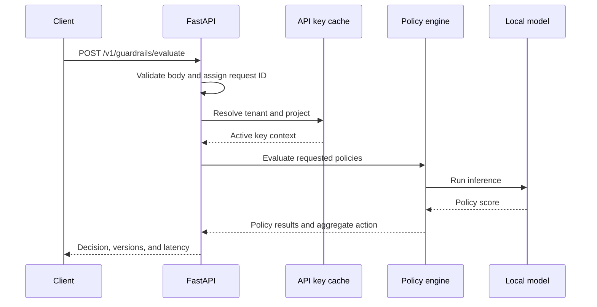

# Inference Path

## Current implementation

The Phase 1 API has no inference endpoint yet. The `/ready` route becomes ready after the FastAPI startup hook completes.

## Planned request lifecycle

Raw input will not be logged by default. Later implementation phases will make the diagram match the actual request path and document failure responses.
