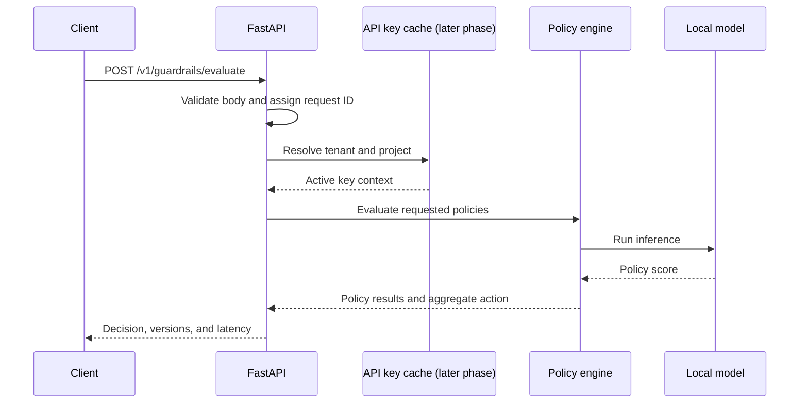

# Inference Path

## Current implementation

The Phase 6 API validates a 1–10,000 character input, resolves the requested policies from an in-process registry, evaluates each enabled policy, applies `ANY_BLOCK` aggregation, and returns per-policy scores, thresholds, category names, model revisions, a request ID, and handler latency. The toxicity, PII, and prompt-injection policies each use review and block thresholds. PII responses contain entity types only; detected values are never returned. At startup, optional PostgreSQL model metadata selects exact MinIO artifacts; the service verifies and loads them into local process memory before warm-up. `/ready` remains unavailable until model and PII initializers finish.

## Planned request lifecycle

Raw input will not be logged by default. Later implementation phases will make the diagram match the actual request path and document failure responses.
