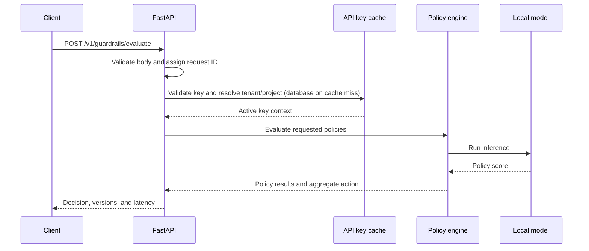

# Inference Path

## Current implementation

The Phase 7 API validates a 1–10,000 character input, authenticates the bearer key, resolves tenant/project context through a short-lived in-process cache, evaluates the requested policies, applies `ANY_BLOCK` aggregation, and returns per-policy scores, thresholds, category names, model revisions, request ID, tenant/project IDs, and handler latency. The toxicity, PII, and prompt-injection policies each use review and block thresholds. PII responses contain entity types only; detected values are never returned. At startup, PostgreSQL selects exact MinIO model artifacts; the service verifies and loads them into local process memory before warm-up. `/ready` remains unavailable until database, model, and PII initialization finish.

## Planned request lifecycle

Raw input will not be logged by default. Later implementation phases will make the diagram match the actual request path and document failure responses.
