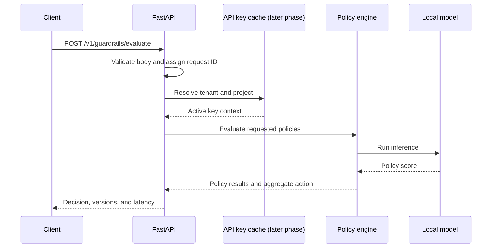

# Inference Path

## Current implementation

The Phase 2 API validates a 1–10,000 character input, runs the loaded toxicity classifier, compares its `toxic` probability to a configurable threshold, and returns the score, action, model revision, request ID, and handler latency. `/ready` remains unavailable until the model is checksum-verified and warmed up.

## Planned request lifecycle

Raw input will not be logged by default. Later implementation phases will make the diagram match the actual request path and document failure responses.
