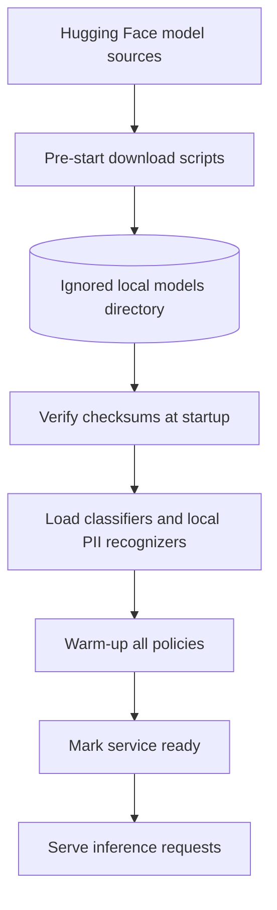

# Model Serving

## Current local lifecycle

The pre-start download scripts fetch only the model, tokenizer, and configuration files for pinned Hugging Face revisions. They write manifests with the resolved revision, license, framework, and SHA-256 checksums. Startup validates every listed checksum, loads the tokenizers and models from local files, initializes the Presidio and spaCy recognizers, runs warm-up inference, and then reports ready. Request handlers only use in-memory implementations.

Phase 6 will move Transformer artifact storage from the local `models/` directory to MinIO. The selected frameworks and licenses are recorded in [the decision log](../DECISIONS.md); resource use will be measured in later profiling and load-test phases.
