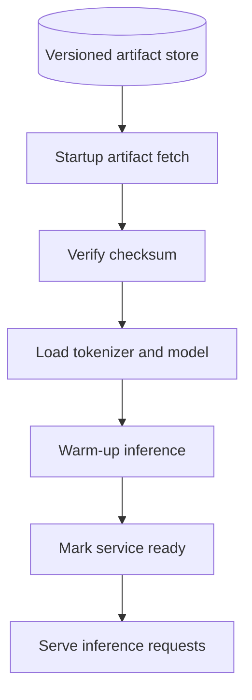

# Model Serving

## Planned lifecycle

Model artifacts will be versioned and loaded before the API accepts inference traffic. Startup will validate artifact checksums, initialize each configured policy implementation, and run a small warm-up inference. `/ready` will remain unavailable if required models fail to load.

The current Phase 1 implementation has no model loader. The serving lifecycle will be implemented in later phases and updated here with the selected framework, model license, versions, and measured resource use.
