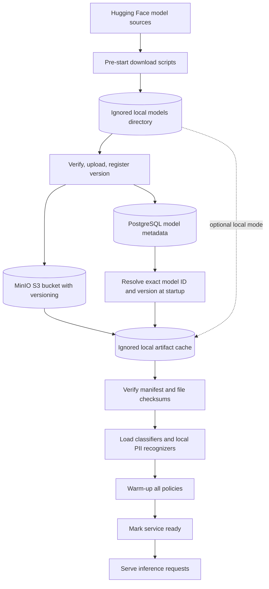

# Model Serving

## Current lifecycle

The pre-start Hugging Face scripts fetch pinned model files and generate per-file SHA-256 manifests. The upload script validates those files, writes them to S3-compatible MinIO under a model/version prefix, enables bucket versioning, and registers the release URI and manifest checksum in PostgreSQL. With MinIO configured, API startup reads each expected model row, downloads a missing version into an ignored local cache, validates the database manifest digest and every file checksum, loads the model locally, initializes Presidio and spaCy, warms each policy, then reports ready. Without MinIO settings, it uses the local Hugging Face artifact directories. Request handlers only use in-memory implementations.

The inference request path does not call PostgreSQL, MinIO, or Hugging Face. MinIO community server is pinned for local evaluation; see [the model-registry guide](../MODEL_REGISTRY.md) for its current upstream status and startup instructions. Model runtime resource use will be measured in the later profiling and load-test phases.
