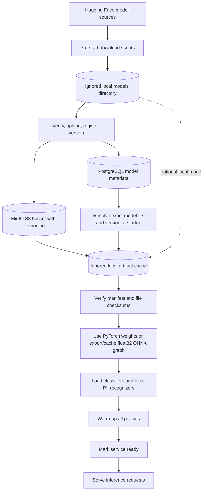

# Model Serving

## Current lifecycle

The pre-start Hugging Face scripts fetch pinned model files and generate per-file SHA-256 manifests. The upload script validates those files, writes them to S3-compatible MinIO under a model/version prefix, enables bucket versioning, and registers the release URI and manifest checksum in PostgreSQL. With MinIO configured, API startup reads each expected model row, downloads a missing version into an ignored local cache, validates the database manifest digest and every file checksum, loads the model locally, initializes Presidio and spaCy, warms each policy, then reports ready. Without MinIO settings, it uses the local Hugging Face artifact directories. Request handlers only use in-memory implementations.

The inference request path does not call PostgreSQL, MinIO, or Hugging Face. `GUARDRAIL_MODEL_RUNTIME=onnxruntime` uses ONNX Runtime's CPU provider for the two Transformer classifiers; the other option, `pytorch`, uses Transformers directly and can select MPS when available. When ONNX is selected, startup exports a graph from the verified local source artifacts if the versioned cache is absent, warms it, and only then marks the API ready. The generated graph cache is a derived artifact under `data/onnx-cache/`; the source weights and their checksum manifest remain unchanged. See [the Phase 10 profile](../performance/phase10-profile.md) for measurements. MinIO community server is pinned for local evaluation; see [the model-registry guide](../MODEL_REGISTRY.md) for its current upstream status and startup instructions.
