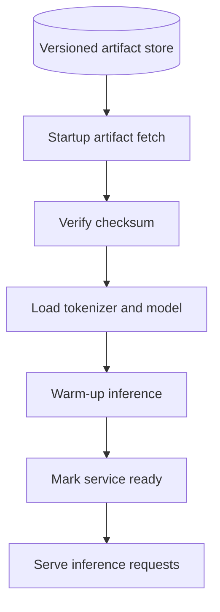

# Model Serving

## Current local lifecycle

The download script fetches only the model, tokenizer, and configuration files for a pinned Hugging Face revision. It writes a manifest with the resolved revision, license, framework, and SHA-256 checksums. Startup validates every listed checksum, loads the tokenizer and model from local files, runs a warm-up inference, and then reports ready. The request handler only uses the loaded in-memory classifier.

Phase 6 will move artifact storage from the local `models/` directory to MinIO. The selected framework and license are recorded in [the decision log](../DECISIONS.md); resource use will be measured in later profiling and load-test phases.
