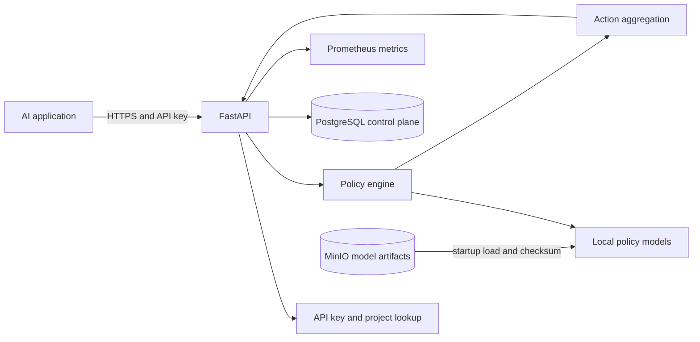

# System Overview

## Current implementation

Phase 3 contains a FastAPI process, validated environment settings, health routes, a policy catalog, a policy registry, `ANY_BLOCK` aggregation, and a toxicity evaluation route. Startup verifies and loads a pinned local model artifact, warms the classifier, and only then reports readiness. The service does not yet connect to a database or external artifact store.

## Target initial architecture

The diagram describes the intended local service, not an assertion that all components are implemented. PostgreSQL and MinIO will hold control-plane metadata and versioned artifacts. Model files will be loaded and warmed before readiness is reported.
