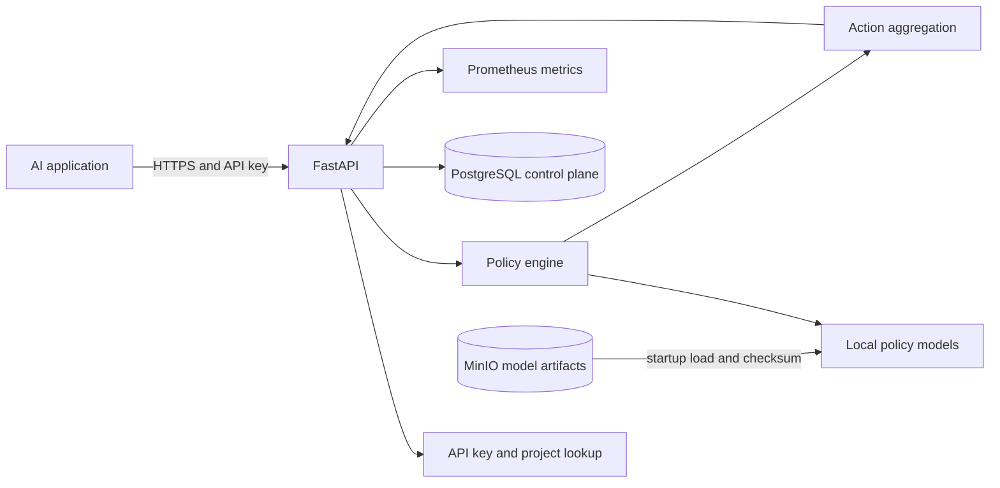

# System Overview

## Current implementation

Phase 1 contains a FastAPI process, validated environment settings, and health, liveness, and readiness routes. It does not yet load models or connect to external services.

## Target initial architecture

The diagram describes the intended local service, not an assertion that all components are implemented. PostgreSQL and MinIO will hold control-plane metadata and versioned artifacts. Model files will be loaded and warmed before readiness is reported.
