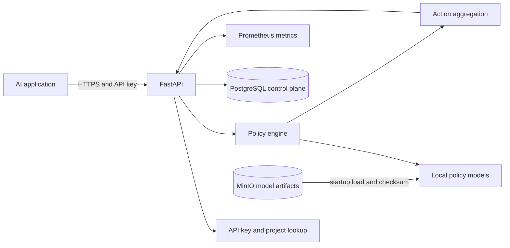

# System Overview

## Current implementation

Phase 6 contains a FastAPI process, validated environment settings, health routes, a policy catalog, a policy registry, `ANY_BLOCK` aggregation, and toxicity, PII, and prompt-injection policies. Startup resolves versioned Transformer artifact metadata from PostgreSQL, retrieves missing files from MinIO using the S3 API, verifies manifest/file checksums, initializes the local NLP pipeline, warms every implementation, and only then reports readiness. PostgreSQL also defines tenant, project, API-key, and policy configuration records; API-key authentication is wired in Phase 7.

## Target initial architecture

The diagram describes the intended local service, not an assertion that all components are implemented. PostgreSQL and MinIO will hold control-plane metadata and versioned artifacts. Model files will be loaded and warmed before readiness is reported.
