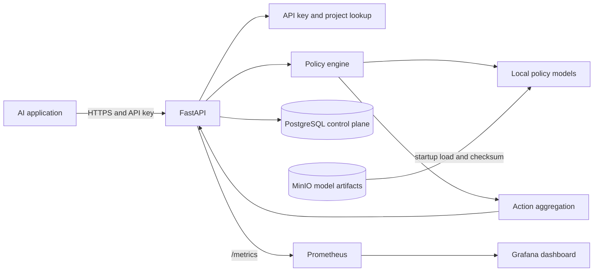

# System Overview

## Current implementation

Phase 10 provides the FastAPI process, PostgreSQL control plane, MinIO model registry, Prometheus metrics, and provisioned Grafana dashboard configuration. `docker-compose.yml` defines containers for the API, PostgreSQL, MinIO, Prometheus, and Grafana; an API image; and one-shot migration and model-preparation services. The Compose stack is configured but still needs a successful engine-backed startup check on a host with a working Docker daemon. The API has validated request settings, health and metrics routes, a policy catalog, a policy registry, `ANY_BLOCK` aggregation, and toxicity, PII, and prompt-injection policies. Request bodies are capped and authenticated evaluations have a process-local per-project rate limit. Startup applies database migrations, resolves versioned Transformer artifacts, retrieves missing files from MinIO using the S3 API, verifies manifest/file checksums, initializes the local NLP pipeline, loads or exports the selected Transformer runtime, warms every policy, and only then reports readiness. Evaluation requests authenticate bearer keys and resolve tenant/project scope from a bounded in-process cache, querying PostgreSQL on a cache miss. Key creation and revocation are project-scoped. Request IDs flow through HTTP and evaluation responses; JSON logs and Prometheus metrics expose operational context without request text.

## Target initial architecture

The diagram describes the intended local Compose topology. PostgreSQL and MinIO hold control-plane metadata and versioned artifacts. Model files are loaded and warmed before readiness is reported. Prometheus scrapes the API's internal `api:8000` address, and Grafana reads from Prometheus over the Compose network.
