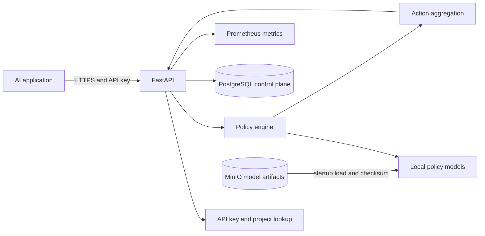

# System Overview

## Current implementation

Phase 5 contains a FastAPI process, validated environment settings, health routes, a policy catalog, a policy registry, `ANY_BLOCK` aggregation, and toxicity, PII, and prompt-injection policies. Startup verifies and loads two pinned local Transformer artifacts, initializes Presidio and the local spaCy NER model, warms every implementation, and only then reports readiness. SQLAlchemy models and an Alembic migration define PostgreSQL tenant, project, API-key, policy, and model-version records; API authentication and database-backed runtime configuration are wired in later phases.

## Target initial architecture

The diagram describes the intended local service, not an assertion that all components are implemented. PostgreSQL and MinIO will hold control-plane metadata and versioned artifacts. Model files will be loaded and warmed before readiness is reported.
