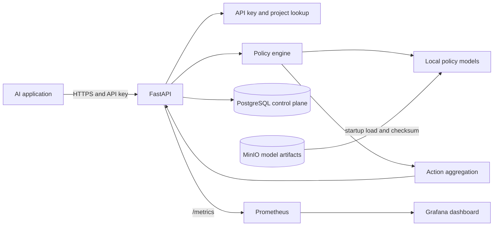
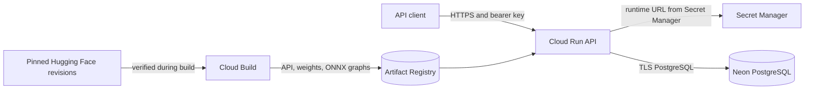

# System Overview

## Current implementation

The implementation provides a FastAPI service, PostgreSQL control plane, local MinIO model registry, Prometheus metrics, and a provisioned Grafana dashboard. `docker-compose.yml` defines the API, PostgreSQL, MinIO, Prometheus, and Grafana containers, along with migration and model-preparation jobs. The full stack was built and verified on Apple Silicon ARM64. The API has validated request settings, health and metrics routes, a policy catalog, a policy registry, `ANY_BLOCK` aggregation, and toxicity, PII, and prompt-injection policies. Request bodies are capped and authenticated evaluations have a process-local per-project rate limit. Startup applies database migrations, resolves versioned Transformer artifacts, retrieves missing files from MinIO using the S3 API, verifies manifest/file checksums, initializes the local NLP pipeline, loads or reuses the selected Transformer runtime, warms every policy, and only then reports readiness. Evaluation requests authenticate bearer keys and resolve tenant/project scope from a bounded in-process cache, querying PostgreSQL on a cache miss. Key creation and revocation are project-scoped. Request IDs flow through HTTP and evaluation responses; JSON logs and Prometheus metrics expose operational context without request text.

## Target initial architecture

The diagram describes the verified local Compose topology. PostgreSQL and MinIO hold control-plane metadata and versioned artifacts. Model files are loaded and warmed before readiness is reported. Prometheus scrapes the API's internal `api:8000` address, and Grafana reads from Prometheus over the Compose network.

## Cloud deployment target

The deployment guide uses Cloud Run for the API and Neon for durable PostgreSQL. Cloud Build verifies and packages the pinned source weights and ONNX graphs in an immutable image; Cloud Run gets the runtime database URL from Secret Manager. Its managed HTTPS endpoint is public, while inference still requires a project-scoped bearer key.

The Cloud Run service scales to zero and is capped at one instance with 4 GiB of memory. It does not mount a writable model disk; the models and ONNX graphs are versioned with the container image. See [the deployment guide](../DEPLOYMENT.md) for provisioning and verification steps.
