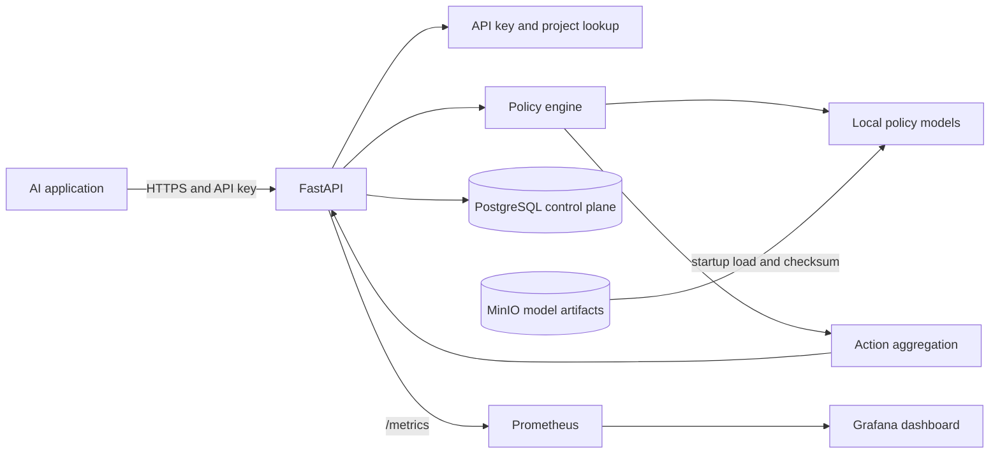

# System Overview

## Current implementation

Phase 8 contains a FastAPI process, validated settings, health and metrics routes, a policy catalog, a policy registry, `ANY_BLOCK` aggregation, and toxicity, PII, and prompt-injection policies. Startup checks PostgreSQL, resolves versioned Transformer artifacts, retrieves missing files from MinIO using the S3 API, verifies manifest/file checksums, initializes the local NLP pipeline, warms every implementation, and only then reports readiness. Evaluation requests authenticate bearer keys and resolve tenant/project scope from a bounded in-process cache, querying PostgreSQL on a cache miss. Key creation and revocation are project-scoped. Request IDs flow through HTTP and evaluation responses; JSON logs and Prometheus metrics expose operational context without request text. Prometheus and Grafana provisioning is ready for the later Compose phase.

## Target initial architecture

The diagram describes the current local service and its planned container topology. PostgreSQL and MinIO hold control-plane metadata and versioned artifacts. Model files are loaded and warmed before readiness is reported. Prometheus and Grafana provisioning is present; Docker Compose wiring is part of the next phase.
